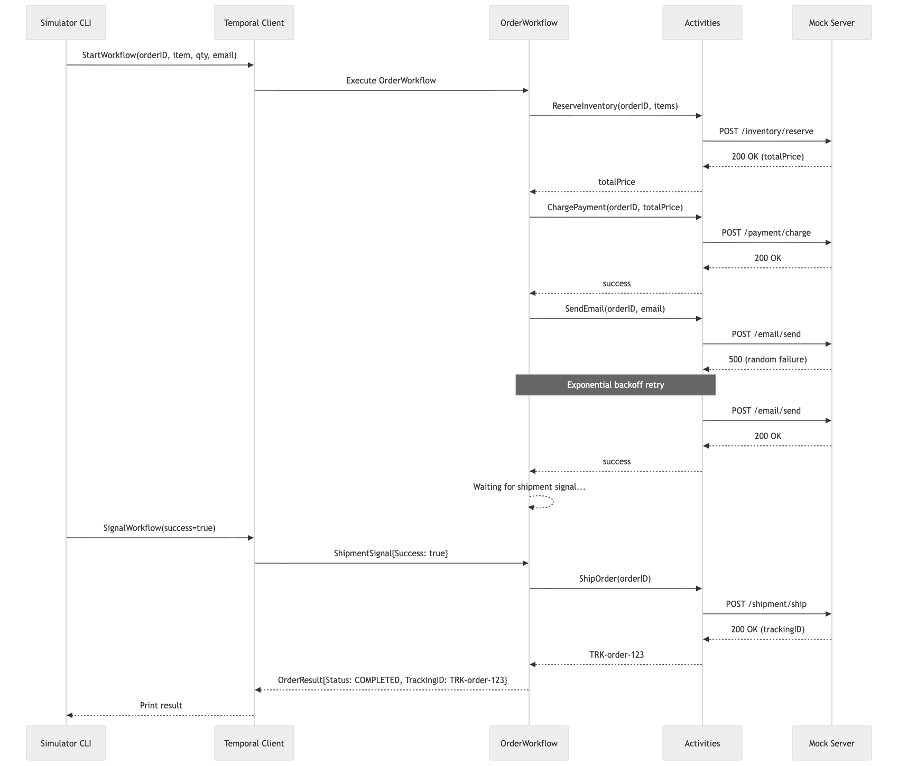
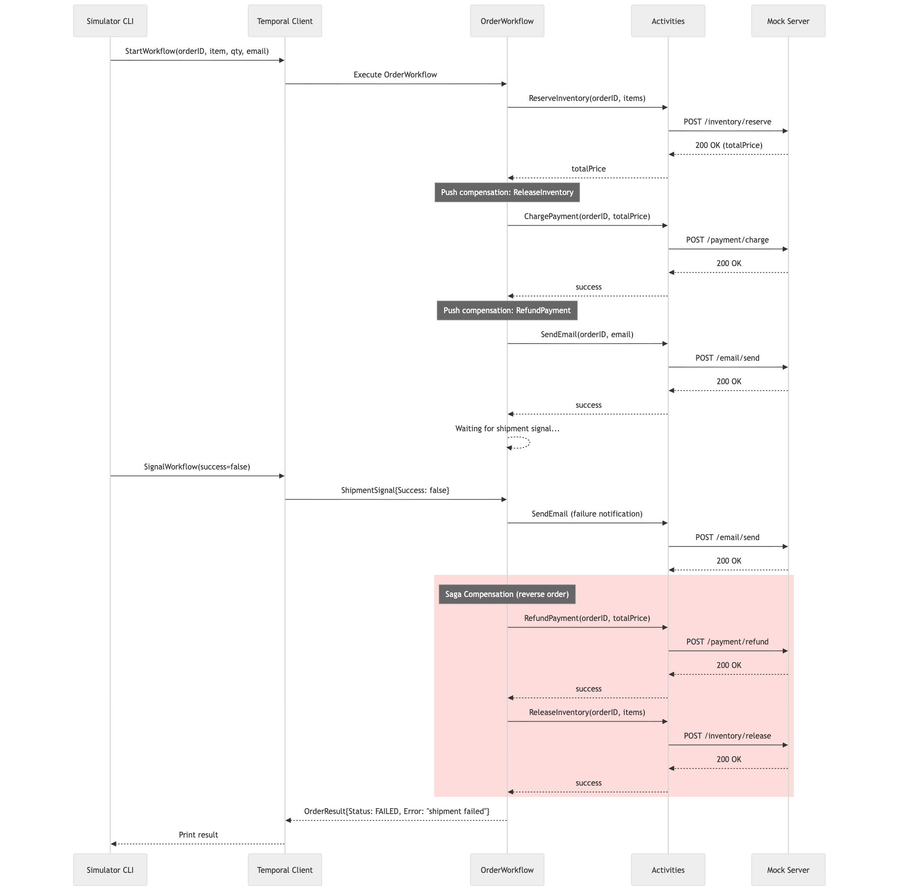

# Order Workflow — Temporal + Go

An e-commerce order workflow built with [Temporal](https://temporal.io) and Go. Once an order is placed, the system reserves inventory, processes payment, sends a confirmation email, and waits for a shipment signal to complete.

## Requirements

- Go 1.25.7 (tested)
- Temporal Server running locally (default `localhost:7233`)
  - Easiest way: `temporal server start-dev --db-filename db1.db`

## Project Structure

```
.
├── cmd/
│   ├── mockserver/    # Mock API server (inventory, payment, email, shipment)
│   ├── simulator/     # CLI to start workflows and send signals
│   └── worker/        # Temporal worker
├── activity/          # Temporal activity implementations
├── workflow/          # Temporal workflow definition
├── model/             # Shared types (OrderInput, OrderResult, etc.)
├── mockserver/        # Mock server handlers and in-memory inventory
└── docs/              # Sequence diagrams
```

## Workflow Steps

1. **Reserve Inventory** — Checks stock and decrements quantity. Returns total price. Fails with a non-retryable error if item is not found or insufficient stock.
2. **Charge Payment** — Charges the total price from step 1. On failure, runs saga compensation to release inventory.
3. **Send Email** — Sends confirmation email with exponential backoff retry. Non-retryable errors (e.g. invalid email address) are logged and the workflow proceeds.
4. **Wait for Shipment Signal** — Waits for an external signal (`shipmentSuccess` or `shipmentFailed`).
5. **Ship Order** — On success signal, calls the shipment API and returns a tracking ID. On failure signal or ship API error, sends a failure notification email and runs full saga compensation (refund payment + release inventory).

## In-Memory Inventory

The mock server starts with these items:

| Item ID    | Price  | Quantity |
|------------|--------|----------|
| ITEM-001   | $29.99 | 100      |
| ITEM-002   | $49.99 | 50       |
| ITEM-003   | $9.99  | 200      |

Query inventory: `GET http://localhost:8080/inventory` or `GET http://localhost:8080/inventory/ITEM-001`

## Build

```bash
go build ./...
```

This compiles all three binaries (mock server, worker, simulator)
```

## How to Run

Open 3 terminal windows:

### 1. Start the Temporal Server

```bash
temporal server start-dev --db-filename db1.db
```

### 2. Start the Mock Server

```bash
go run cmd/mockserver/main.go
```

This starts the mock API on `http://localhost:8080`.

### 3. Start the Worker

```bash
//Will read the address and port from TEMPORAL_ADDRESS env variable, if not set, it will try to connect to localhost:7233 (hardcoded on the worker code)
go run cmd/worker/main.go
```

### 4. Run the Simulator

The simulator accepts:
- `--workflow` (required) — Workflow/Order ID
- `--order` (required) — JSON with `item_id`, `quantity`, and `email`
- `--step` (optional) — `shipmentSuccess` or `shipmentFailed`

#### Happy path (shipment success)

```bash
go run cmd/simulator/main.go --workflow order-001 --order '{"item_id":"ITEM-001","quantity":2,"email":"customer@example.com"}' --step shipmentSuccess
```

#### Shipment failure (full saga rollback)

```bash
go run cmd/simulator/main.go --workflow order-002 --order '{"item_id":"ITEM-002","quantity":1,"email":"customer@example.com"}' --step shipmentFailed
```

#### Start workflow and send signal later

Terminal A — start the workflow (it will wait for a signal):
```bash
go run cmd/simulator/main.go --workflow order-003 --order '{"item_id":"ITEM-001","quantity":5,"email":"customer@example.com"}'
```

Terminal B — send the shipment signal:
Before running the following command, you can restart the worker or the temporal server
```bash
go run cmd/simulator/main.go --workflow order-003 --order '{"item_id":"ITEM-001","quantity":5,"email":"customer@example.com"}' --step shipmentSuccess
```

## Mock Server Behavior

- **Email**: 50% random failure rate (retried with exponential backoff). Returns 422 for `invalid@nonexistent.test` (non-retryable).
- **Payment**: Logs the amount being charged/refunded (e.g. `I am charging $59.98`).
- **Inventory**: Validates stock availability. Returns 409 if insufficient. Quantities are restored on release (saga compensation).

## Sequence Diagrams

See [docs/sequence-diagram.md](docs/sequence-diagram.md) for detailed Mermaid sequence diagrams covering all scenarios.

### Happy Path


### Shipment Failure

