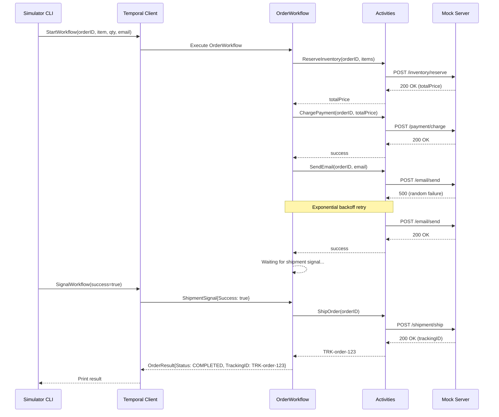
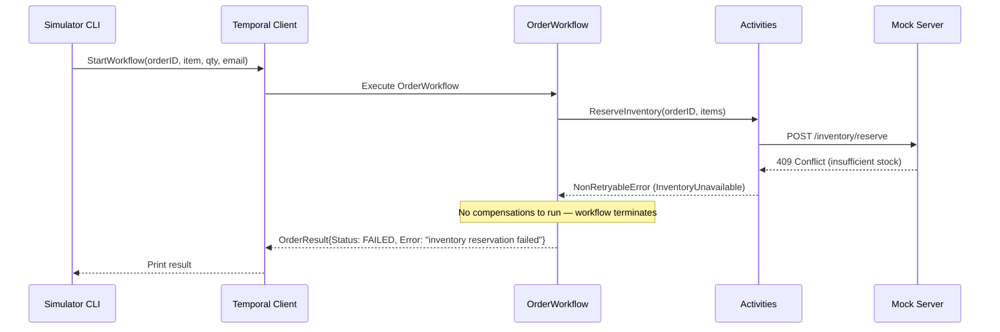
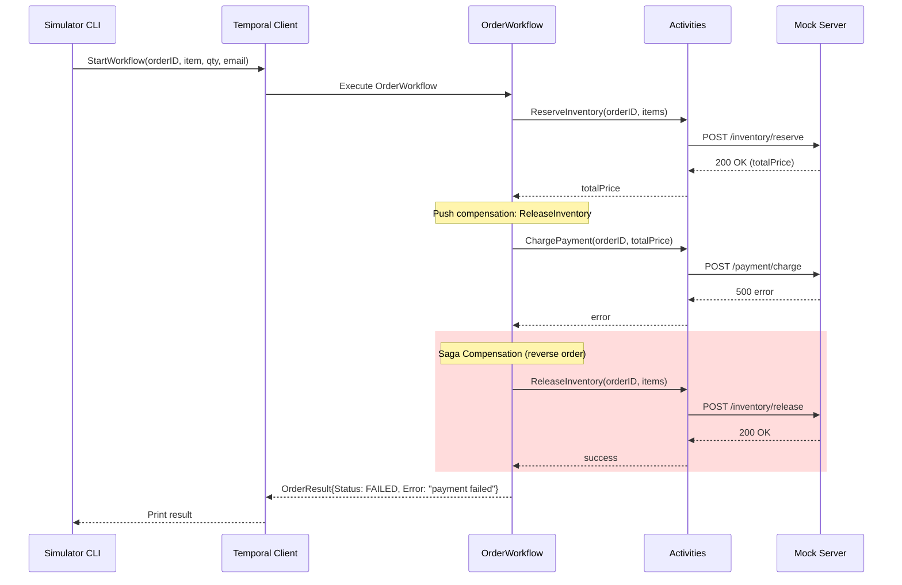
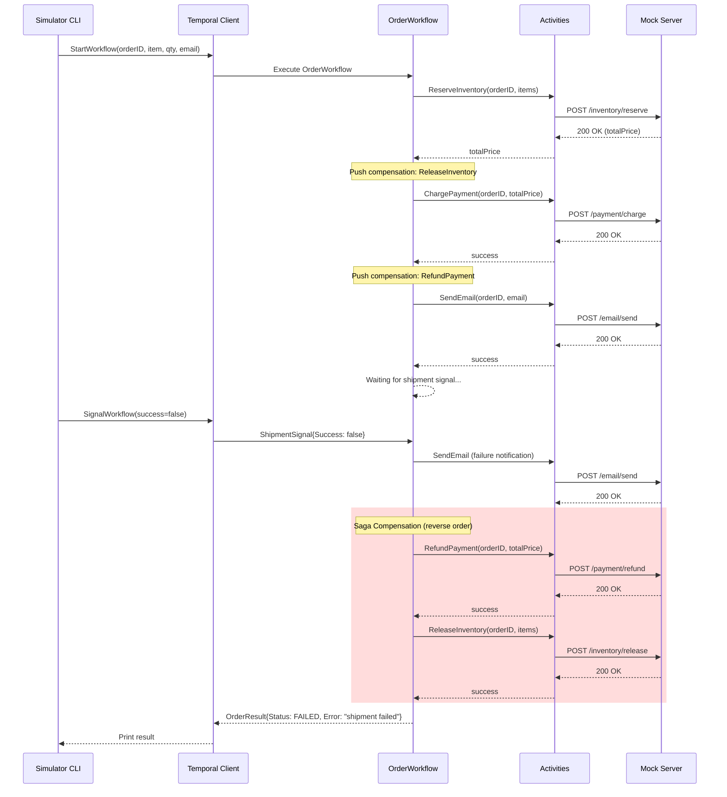

# Order Workflow — Sequence Diagrams

## Happy Path (shipmentSuccess)

## Inventory Reservation Failure

## Payment Failure with Saga Rollback

## Shipment Failure with Full Saga Rollback (shipmentFailed)

